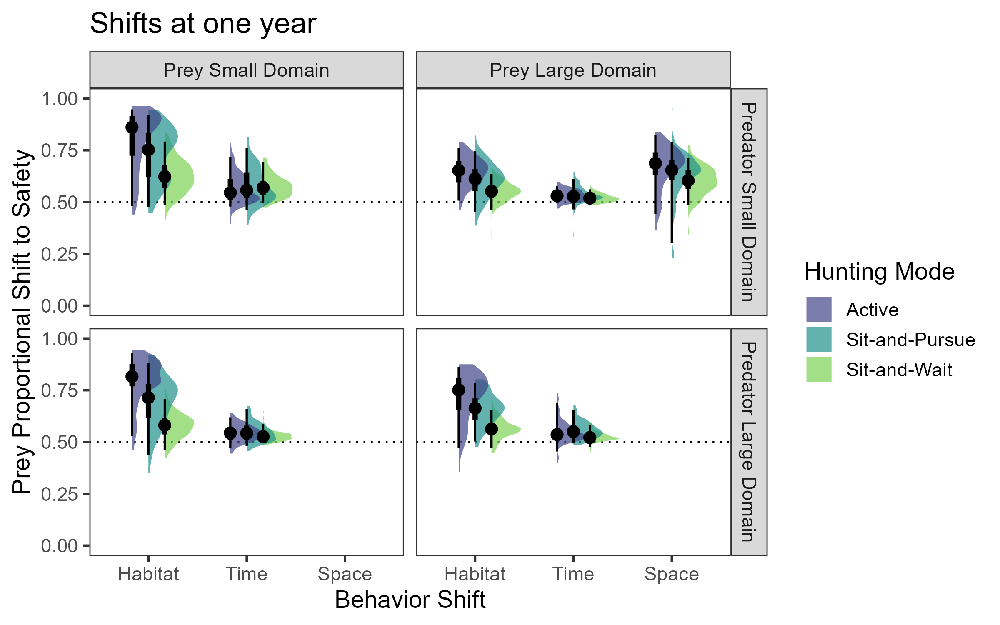

# PredPrey-HabitatDomains

#### Collaborators:
- Kaggie Orrick
- Freya Rowland
- Nathalie Sommer
- Kristy Ferraro

## Current figures

For each of these, the p-value is survival difference between the consumptive (null) and non-consumptive (NCE) models. The vertical lines show the median survival of each curve. Suggestions on colors or tweaks are welcome. All code is under [RScripts/StatsModels_survival_v2.R](RScripts/StatsModels_survival_v2.R)

# Active survival

# Sit-and-pursue survival

# Sit-and-wait survival

# All survival compared

## Five year NCE data hazard tables

[Explanation of hazard ratio table](<https://www.emilyzabor.com/tutorials/survival_analysis_in_r_tutorial.html#Estimating_survival_curves_with_the_Kaplan-Meier_method>)

The quantity of interest from a Cox regression model is a hazard ratio (HR). The HR represents the ratio of hazards between two groups at any particular point in time.
The HR is interpreted as the instantaneous rate of occurrence of the event of interest in those who are still at risk for the event. It is not a risk, though it is commonly interpreted as such.

If you have a regression parameter β (from column estimate in our coxph) then HR = exp(β).

A **HR < 1 indicates reduced hazard of death** whereas a **HR > 1 indicates an increased hazard of death**.
So a HR = 0.59 implies that around 0.6 times as many females are dying as males, at any given time.

**For reference:
- propHabitat = proportion of time spent on white vs. black spaces = **space shift**
- propPredFree = proportion of time spent in hrs where predators are not active = **time shift**
- propSafeSpace = proportional habitat shift to areas where predators are excluded (so only in Prey.Start.Con = Large and Pred.Start.Con = Small) = **habitat shift**

### Model 1: Prey behavioral changes and hazard ratio

*mod1 <- coxph(Surv(year, status) ~ propHabitat + propPredFree + propSafeSpace* 
Note: this model does NOT account for predator strategy. So this is general for all predator strategies. But I think we use this because it assesses how survival changes based on prey behavior. Which allows us to directly compare.

So if we group all predators together, prey can significantly reduce mortality with behavior. In order from best to worst ways to increase probability of survival 1) shift time, 2) use predator free area, and 3) shift space. 

### Model 4: Kitchen sink of starting conditions
*mod <- coxph(Surv(year, status) ~ Pred.Strat + Pred.Start.Con * Prey.Start.Con*

**FER opinion: I think this is the one we should use**
This is cool. 

- Predator strategy mirrors what we've known a while (Risk in Active = Sit-and-Puruse > Sit-and-Wait)
- Prey are significantly less likely to die when predators constrained to a small domain
- Prey starting condition doesn't seem to matter much
- Huge hazard increase when both predator and prey are in small starting domain! Almost 3x more prey are dying in that than other starting conditions.

### The hazard ratios of each predator strategy/predator domain/prey domain combination

All hazard ratio data for each combination are summarized in [HazardRatioSummary_Feb2022.csv](Data/HazardRatioSummary_Feb2022.png)

# Hazard ratio summary figure

Hazard ratio summary figure. HR = 1 (no benefit or detriment) is dotted. I think we should do something like this.

# Behavioral shifts at year one

To make tweaks: https://mjskay.github.io/ggdist/reference/stat_halfeye.html

# Next steps
- [ ] Figure out how the heck to specify which order panels facet in and the labels on facet_grid
