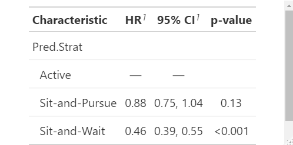
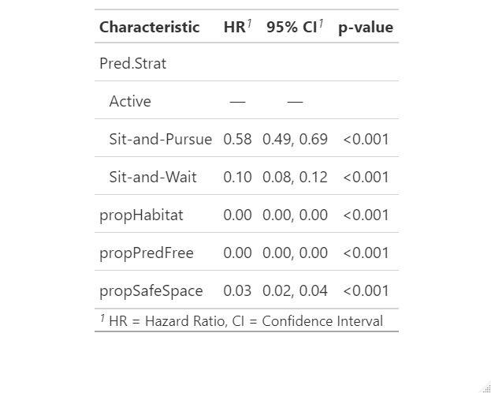
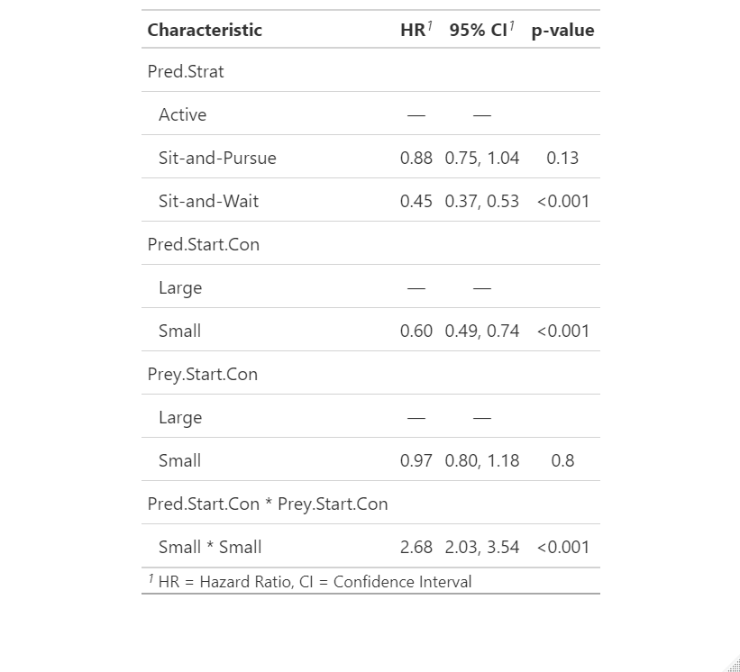
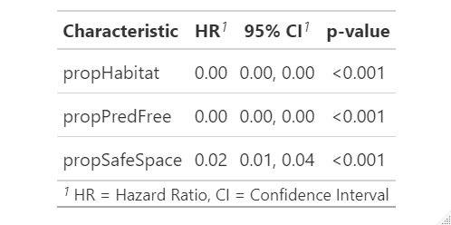
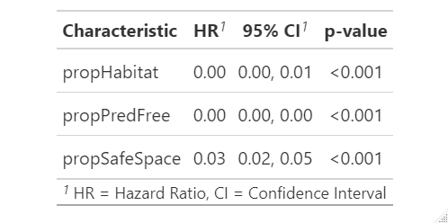
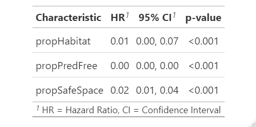
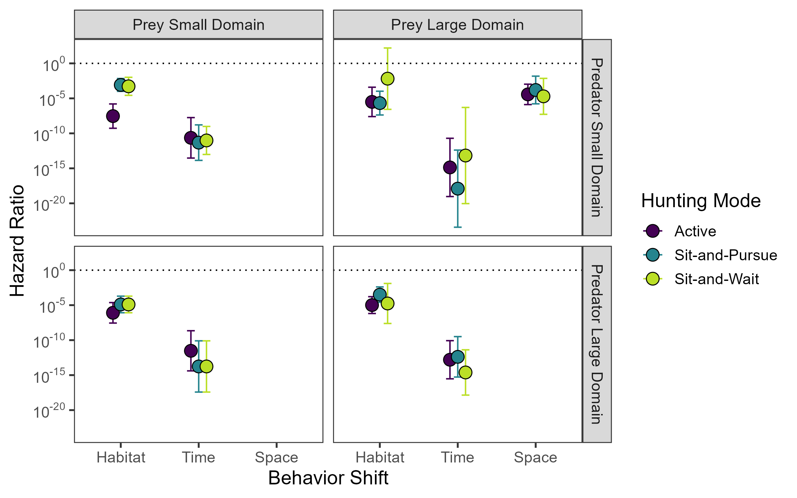

# PredPrey-HabitatDomains

#### Collaborators:
- Kaggie Orrick
- Freya Rowland
- Nathalie Sommer
- Kristy Ferraro

## Current figures (they're ugly. I'll make them pretty once we decide!)
# Active survival

# Sit-and-wait survival

# Sit-and-pursue survival

# All survival compared

## Five year NCE data hazard tables

[Explanation of hazard ratio table](<https://www.emilyzabor.com/tutorials/survival_analysis_in_r_tutorial.html#Estimating_survival_curves_with_the_Kaplan-Meier_method>)

The quantity of interest from a Cox regression model is a hazard ratio (HR). The HR represents the ratio of hazards between two groups at any particular point in time.
The HR is interpreted as the instantaneous rate of occurrence of the event of interest in those who are still at risk for the event. It is not a risk, though it is commonly interpreted as such.

If you have a regression parameter β (from column estimate in our coxph) then HR = exp(β).

A **HR < 1 indicates reduced hazard of death** whereas a **HR > 1 indicates an increased hazard of death**.
So a HR = 0.59 implies that around 0.6 times as many females are dying as males, at any given time.

**For reference:
- propHabitat = proportion of time spent on white vs. black spaces = **space shift**
- propPredFree = proportion of time spent in hrs where predators are not active = **time shift**
- propSafeSpace = proportional habitat shift to areas where predators are excluded (so only in Prey.Start.Con = Large and Pred.Start.Con = Small) = **habitat shift**

### Model 1: Prey behavioral changes and hazard ratio

*mod1 <- coxph(Surv(year, status) ~ propHabitat + propPredFree + propSafeSpace* 
Note: this model does NOT account for predator strategy. So this is general for all predator strategies. But I think we use this because it assesses how survival changes based on prey behavior. Which allows us to directly compare.

So if we group all predators together, prey can significantly reduce mortality with behavior. In order from best to worst ways to increase probability of survival 1) shift time, 2) use predator free area, and 3) shift space. 

### Model 2: Comparing predator strategy and hazard ratios
*mod2 <- coxph(Surv(year, status) ~ Pred.Strat*

I hate how it sets the first strategy to the intercept, but it works okay here because we can see that Active and Sit-and-Pursue have no difference in hazard/survival probability to prey. But! This is cool because we can quantitatively say HR = 0.46 means that half as many prey are dying in the Sit-and-Wait simulations compared to active predator simulations. 

### Model 3: Kitchen sink model, because why not?
*mod <- coxph(Surv(year, status) ~ Pred.Strat + propHabitat + propPredFree + propSafeSpace*

I can't figure out how to have predator strategy be a random effect in these models. And I think this isn't a great idea because strategy affects shifts, but statisticians just run all of the things and see what falls out. 

Oddly, in the kitchen sink model there is a difference in survival of Active vs. Sit-and-Pursue. Sit-and-Pursue HR = 0.58, so 0.58 prey are dying in Sit-and-Pursue compared to Active prey. Sit-and-Wait HR = 0.10! But I'm not sure if I trust this model because now space shifts and time shifts have lower hazard than habitat shifts. Maybe because habitat shifts can only happen in 1/4 of the scenarios? 

### Model 4: Kitchen sink of starting conditions
*mod <- coxph(Surv(year, status) ~ Pred.Strat + Pred.Start.Con * Prey.Start.Con*

**FER opinion: I think this is the one we should use**
This is cool. 

- Predator strategy mirrors what we've known a while (Risk in Active = Sit-and-Puruse > Sit-and-Wait)
- Prey are significantly less likely to die when predators constrained to a small domain
- Prey starting condition doesn't seem to matter much
- Huge hazard increase when both predator and prey are in small starting domain! Almost 3x more prey are dying in that than other starting conditions.

### Model 5: Prey behavior changes - Active Predators

> ActiveFiveYearNCE
Call:
coxph(formula = Surv(year, status) ~ propHabitat + propPredFree + 
    propSafeSpace, data = Active5)

|             |       coef | exp(coef)  | se(coef)   |   z    | p |
|:------------|:-----------|:-----------|:-----------|:-------|:---|
|propHabitat |  -7.072e+00 | 8.490e-04 | 6.365e-01 |-11.11 |<2e-16 |
|propPredFree | -2.317e+01 | 8.654e-11 | 1.507e+00 |-15.38 |<2e-16 |
|propSafeSpace |-3.765e+00 | 2.318e-02 | 2.698e-01 |-13.96 |<2e-16|

Likelihood ratio test=777.4  on 3 df, p=< 2.2e-16
n= 400, number of events= 309 

Time shift HR = 0.0000000008 >> Habitat shift HR = 0.0008 >> Space shift HR = 0.02. These are all very small numbers, but this seems to imply that time shifts are by far the best way to avoid mortality in an environment with an active predator. Habitat shift are worst for survival, probably because it's not possible in most scenarios.

### Model 6: Prey behavior changes - Sit-and-Pursue Predators

>Sit-and-PursueFiveYearNCE
Call:
coxph(formula = Surv(year, status) ~ propHabitat + propPredFree + 
    propSafeSpace, data = SP5)

|            |  coef      | exp(coef) |  se(coef)   |   z   |   p |
|:-----------|:-----------|:----------|:------------|:------|:----|
|propHabitat |  -6.129e+00 | 2.179e-03 | 5.405e-01 |-11.34| <2e-16|
|propPredFree | -2.233e+01 | 2.010e-10  |1.375e+00 |-16.24| <2e-16|
|propSafeSpace |-3.433e+00 | 3.229e-02 | 2.677e-01 |-12.82| <2e-16|

Likelihood ratio test=735.5  on 3 df, p=< 2.2e-16
n= 400, number of events= 292

Time shift is still much better than a habitat shift in reducing mortality, but both are helpful. Same pattern as Active Predators, which is comforting because this pattern is reoccuring.

### Model 7: Prey behavior changes - Sit-and-Wait Predators

> SWFiveYearNCE
Call:
coxph(formula = Surv(year, status) ~ propHabitat + propPredFree + 
    propSafeSpace, data = SW5)

|            |        coef | exp(coef) |  se(coef)   |    z   |     p|
|:-----------|:------------|:----------|:------------|:-------|:-----|
|propHabitat |  -4.668e+00 | 9.391e-03 | 1.002e+00 | -4.656| 3.22e-06|
|propPredFree | -1.770e+01 | 2.053e-08 | 1.144e+00 |-15.471 | < 2e-16|
|propSafeSpace |-3.795e+00 | 2.248e-02 | 3.191e-01 |-11.894 | < 2e-16|

Likelihood ratio test=413.3  on 3 df, p=< 2.2e-16
n= 400, number of events= 220

For prey around sit-and-wait predators, we see some the same patterns, but the hazard ratios are not nearly as small, suggesting less risk to prey overall. Time shifts still reduce mortality most, followed by space shifts, and then habitat shifts.

# Potential summary figure

Do something like this plus error bars?

# Next steps
- [ ] Do we compare end points? We could compare Time 1 yr vs. Time 5 yr for example by setting tstart and tstop. Is there a benefit to eliminating burnin period (our age old debate)
- [ ] Compare one-yr vs. five-yr data?
- [ ] Is "safe space" even something we want to include in models? Yes
- [ ] To add: individual hazard tables for each pred x starting domain combination
- [ ] Figure out a summary figure -- maybe a) median survival time in NCE vs. null colored by P-value, b) hazard ratio for combinations.
