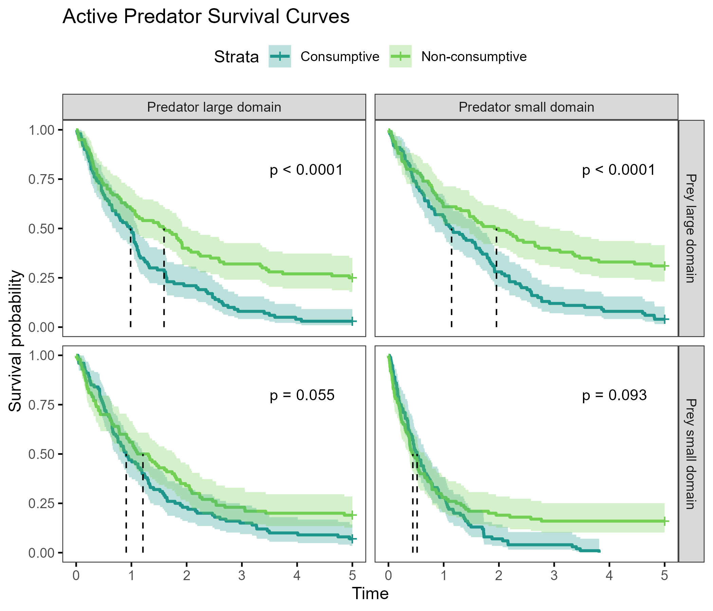
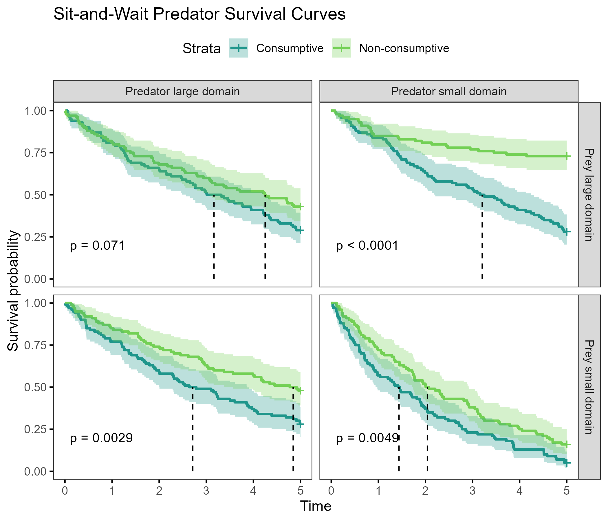
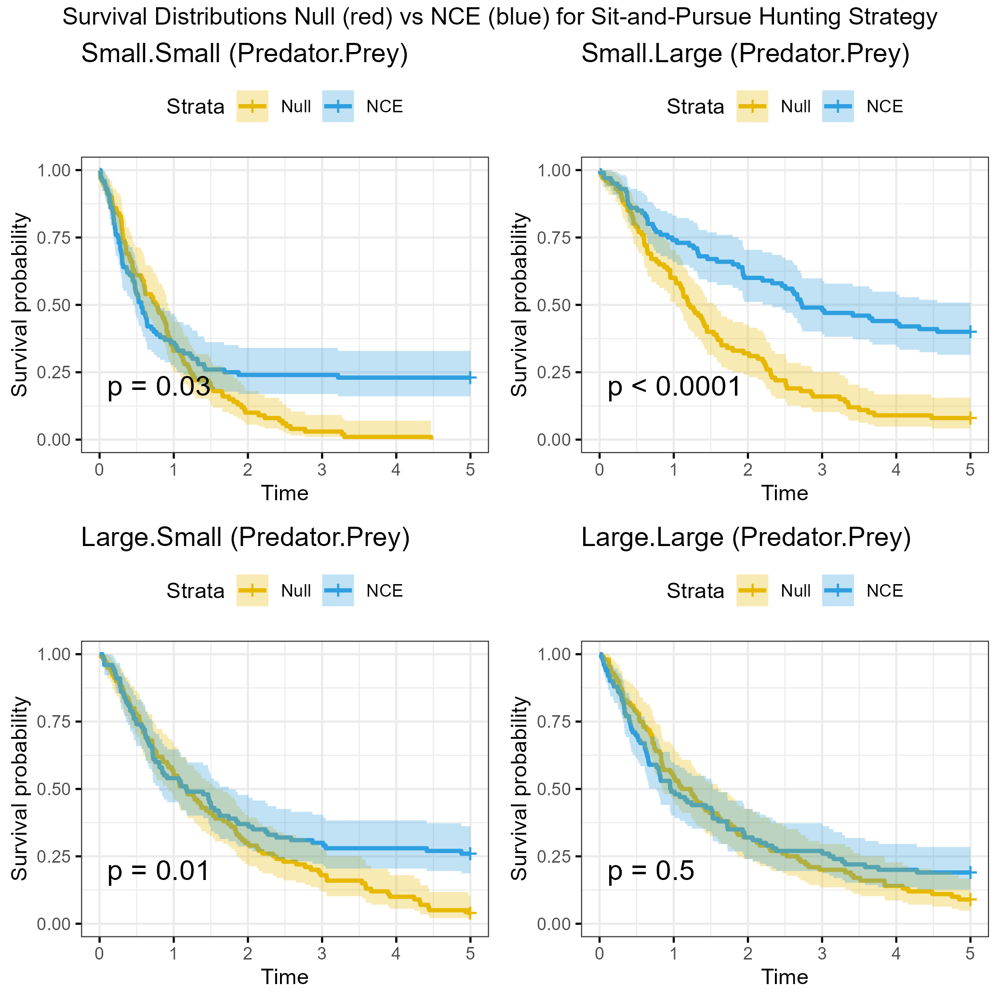
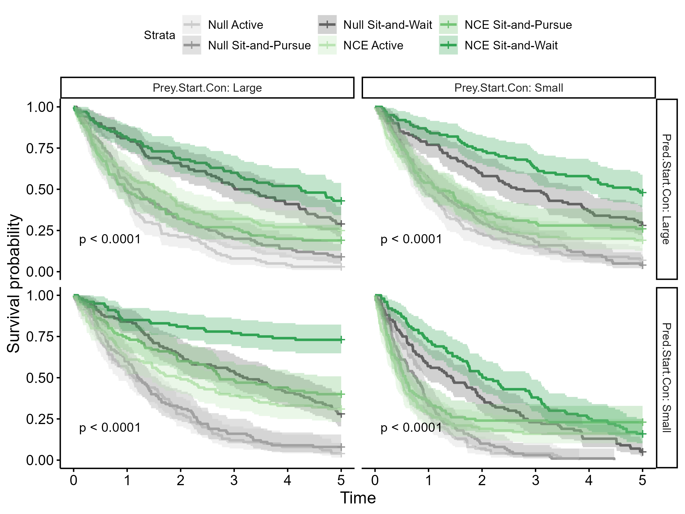
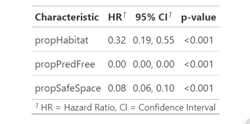

# PredPrey-HabitatDomains

#### Collaborators:
- Kaggie Orrick
- Freya Rowland
- Nathalie Sommer
- Kristy Ferraro

## Current figures
# Active survival

# Sit-and-wait survival

# Sit-and-pursue survival

# All survival compared

# A hazard table

[Explanation of hazard ratio table](<https://www.emilyzabor.com/tutorials/survival_analysis_in_r_tutorial.html#Estimating_survival_curves_with_the_Kaplan-Meier_method>)

The quantity of interest from a Cox regression model is a hazard ratio (HR). The HR represents the ratio of hazards between two groups at any particular point in time.
The HR is interpreted as the instantaneous rate of occurrence of the event of interest in those who are still at risk for the event. It is not a risk, though it is commonly interpreted as such.

If you have a regression parameter β (from column estimate in our coxph) then HR = exp(β).

A HR < 1 indicates reduced hazard of death whereas a HR > 1 indicates an increased hazard of death.
So a HR = 0.59 implies that around 0.6 times as many females are dying as males, at any given time.

*This is all rather new to me, but I think this implies that all significantly reduce mortality. In order from best to worst ways to increase survival 1) shift time, 2) use predator free area, and 3) shift space.*
